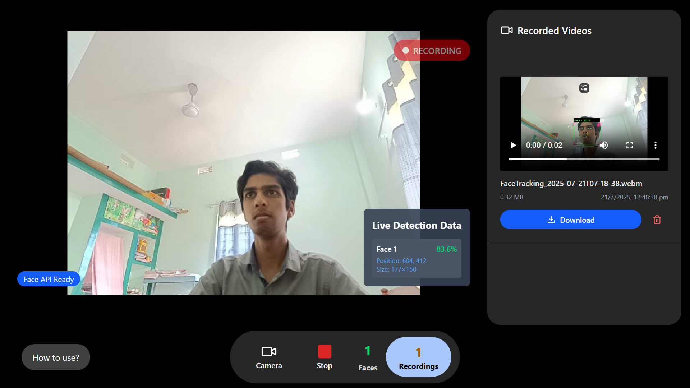

> 👆 Click the image above to view the live demo of the app.

# Face Tracking Application

## Features

- Real-time **facial landmark detection**
- **Multi-face tracking** with unique IDs
- **Video recording** with face detection overlays
- **Download recorded videos** for offline viewing

---

## Bug in this app:

> ❗ During video preview, the canvas does **not display face labels** correctly.  
However, **after downloading**, the video shows proper face detection overlays.

---

## 🖼️ Preview
- live detection on face and recording video
  

- downloaded video file from recording.
  

---

## 🛠️ Tech Stack

- **Frontend**: React, Next.js
- **Face Detection**: [face-api.js](https://github.com/justadudewhohacks/face-api.js)
- **Deployment**: Vercel

---